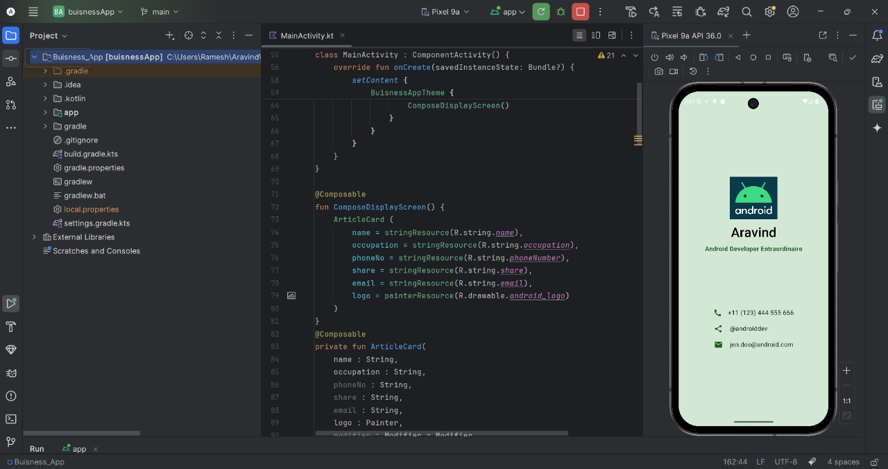
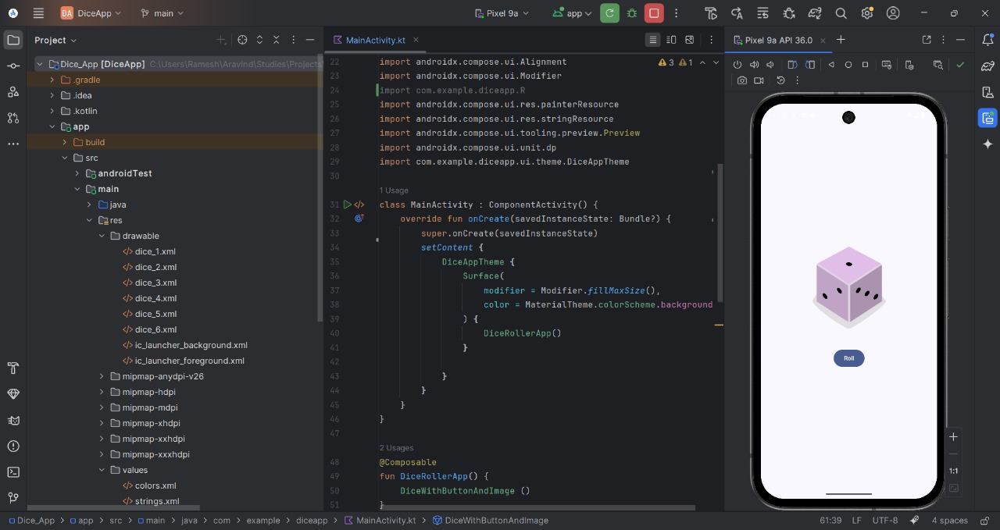

# Jetpack Compose Labs 🎨

A collection of mini projects and exercises from the **Google Developers Android Jetpack Compose training**.  
Each project explores a new concept of modern declarative UI in Kotlin using Jetpack Compose.

---

## 📱 Projects

### 1️⃣ Business Card App 🪪
A simple business card layout built using **Column**, **Row**, and **Box** composables.  
It demonstrates text styling, layout alignment, background colors, and icon usage.

**Preview:**

**Key concepts learned:**
- Column and Row alignment  
- Image and Text composables  
- Modifier usage (`padding`, `background`, `fillMaxSize`)  
- Font styles and colors  

---

### 2️⃣ Dice Roller App 🎲
An interactive app that displays a dice image which changes when the user presses the **Roll** button.

**Preview:**

**Key concepts learned:**
- `Button` and `Image` composables  
- State management with `remember` and `mutableStateOf`  
- Random number generation  
- Recomposition in action  

---

## 🧠 Tech Stack
- **Language:** Kotlin  
- **UI Toolkit:** Jetpack Compose  
- **IDE:** Android Studio  
- **Architecture:** Declarative UI with State

---

## 🚀 Author
**Aravind**  
Android Developer in training | Passionate about building modern, declarative UIs.

---
>>>>>>> 61a1eab2470352379179d33446e0d6e69ebf08fd
